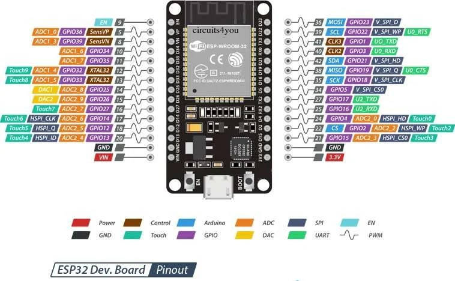

# ESP32 Live API Client (Pepebot)

This project is an ESP32 firmware for two-way audio streaming (input and output) to a WebSocket server (Pepebot Live API). It captures audio from an I2S microphone, sends it over WebSocket, and plays server audio responses through an I2S speaker amplifier.

## Hardware Requirements

1. **ESP32 development board** (NodeMCU ESP-32S or similar)
2. **I2S microphone (INMP441)**
3. **I2S amplifier (MAX98357A or UDA1334A)**
4. **Small speaker** (for example 3W 4Ohm)
5. Jumper wires
6. **0.91" OLED (JMD0.91A / SSD1306 I2C)** for eye expressions

## Software Requirements

1. **Visual Studio Code**
2. **PlatformIO IDE** extension
3. USB-to-Serial driver (CP210x or CH340 depending on your board)

## Wiring (ESP32 Pinout)

Pin reference image:


Based on `include/config.h`, connect as follows.

### 1) INMP441 Microphone (Audio Input)
| INMP441 Pin | ESP32 Pin | Notes |
| :---: | :---: | :--- |
| **VDD** | 3.3V | Power (use 3.3V, not 5V) |
| **GND** | GND | Ground |
| **L/R** | GND | Channel select (Low = Left) |
| **WS** | GPIO 25 | LR clock |
| **SCK** | GPIO 26 | Bit clock |
| **SD** | GPIO 33 | Audio data output |

### 2) MAX98357A Amplifier (Audio Output)
| MAX98357A Pin | ESP32 Pin | Notes |
| :---: | :---: | :--- |
| **VIN** | 5V / 3.3V | Power |
| **GND** | GND | Ground |
| **LRC** | GPIO 14 | LR clock |
| **BCLK** | GPIO 27 | Bit clock |
| **DIN** | GPIO 12 | Audio data input |
| **SD / SD_MODE** | VDD / float | Leave floating or tie to VDD |
| **Speaker +/-** | Speaker terminals | Connect to speaker |

### 3) OLED Display JMD0.91A (I2C)
| OLED Pin | ESP32 Pin | Notes |
| :---: | :---: | :--- |
| **VCC** | 3.3V | Power |
| **GND** | GND | Ground |
| **SCL** | GPIO 22 | I2C clock (`I2C_SCL`) |
| **SDA** | GPIO 21 | I2C data (`I2C_SDA`) |

### 4) BOOT Button Behavior
- The built-in **BOOT button** (`BUTTON_PIN = GPIO0`) is used as a display action button.
- When **not pressed**, the OLED shows cute animated eye expressions.
- While the button is **pressed and held**, the OLED switches to info view and shows:
  - ESSID (current WiFi SSID)
  - IP address
  - WebSocket URI (shortened if too long)
- When the button is **released**, it returns to eye animation.

## Build, Upload, and Monitor

Make sure PlatformIO is installed and your ESP32 is connected via USB.

### 1) Configure WiFi, WS URI, and Initial Prompt (Web Setup)

The firmware no longer uses `include/credentials.h`.

Configuration is stored in **ESP32 NVS** and managed through a setup web page:

- If no SSID is configured, ESP32 starts setup AP mode with SSID: `PEPEBOT-SETUP`
- If WiFi reconnection fails repeatedly, setup AP mode is also enabled automatically
- Captive portal is enabled in setup AP mode, so most phones/laptops will open the setup page automatically
- Connect your phone/laptop to that AP and open:
  - `http://192.168.4.1/`

Fields you can set:
- `wifi_ssid`
- `wifi_pass`
- `ws_uri` (example: `ws://192.168.100.242:18790/v1/live`)
- `initial_prompt`

Available API endpoints:
- `GET /api/config` -> read current config
- `POST /api/config` -> save new config

Setup page is now in a separate file for easier maintenance:
- `data/setup.html`

### 2) Build

```bash
pio run
```

### 3) Upload

```bash
pio run -t upload
```

### 4) Serial Monitor

```bash
pio device monitor -b 115200
```

### 5) Quick Command (Upload + Monitor)

```bash
pio run -t upload && pio device monitor -b 115200
```

## Makefile Shortcuts

This project includes a `Makefile`:

```bash
make build
make upload
make monitor
make all
```

Filesystem data targets:

```bash
make build-data
make upload-data
make data
make erase
```

After editing `data/setup.html`, run:

```bash
make build-data && make upload-data
```

Optional port/baud arguments:

```bash
make upload PORT=/dev/cu.usbserial-XXXX
make monitor PORT=/dev/cu.usbserial-XXXX BAUD=115200
```

## Recommended Setup Commands

For first-time setup (clean device):

```bash
make erase && make data && make all
```

For normal updates without wiping saved config:

```bash
make data && make all
```
